# Proyecto de Regresión — Predicción de Ventas Diarias
### Dataset: Online Retail (UK) · Diciembre 2010 – Diciembre 2011

---

## Índice

1. [Carga del Dataset](#1-carga-del-dataset)
2. [Análisis Exploratorio (EDA)](#2-análisis-exploratorio-eda)
3. [Limpieza de Datos](#3-limpieza-de-datos)
4. [Transformación y Agregación](#4-transformación-y-agregación)
5. [Encoding de Variables](#5-encoding-de-variables)
6. [Normalización](#6-normalización)
7. [Reducción de Dimensionalidad (PCA)](#7-reducción-de-dimensionalidad-pca)
8. [División Train / Val / Test](#8-división-train--val--test)
9. [Entrenamiento de Modelos](#9-entrenamiento-de-modelos)
10. [Conclusiones](#10-conclusiones)

---

## 1. Carga del Dataset

**Archivo fuente:** `contenidoCSV/data.csv`

El dataset proviene del [UCI Machine Learning Repository — Online Retail](https://archive.ics.uci.edu/ml/datasets/Online+Retail) y contiene todas las transacciones de una tienda de comercio electrónico del Reino Unido entre diciembre de 2010 y diciembre de 2011.

### Estructura original

| Columna | Tipo | Descripción |
|---|---|---|
| `InvoiceNo` | int64 | Número de factura (prefijo C = cancelación) |
| `StockCode` | object | Código de producto |
| `Description` | object | Nombre del producto |
| `Quantity` | int64 | Unidades por transacción (negativo = devolución) |
| `InvoiceDate` | object | Fecha y hora de la factura |
| `UnitPrice` | float64 | Precio unitario en £ |
| `CustomerID` | int64 | ID de cliente |
| `Country` | object | País del cliente |

### Dimensiones iniciales

```
Filas: 541,909 | Columnas: 8
```

**Ejemplo de fila:**
```
InvoiceNo: 536365 | StockCode: 85123A | Description: WHITE HANGING HEART T-LIGHT HOLDER
Quantity: 6 | InvoiceDate: 12/1/2010 8:26 | UnitPrice: 2.55 | CustomerID: 17850 | Country: United Kingdom
```

---

## 2. Análisis Exploratorio (EDA)

### 2.1 Calidad de datos inicial

| Problema | Filas | % sobre total |
|---|---|---|
| Quantity ≤ 0 (devoluciones/cancelaciones) | ~10,624 | ~1.96% |
| UnitPrice ≤ 0 (ajustes/gratuitos) | ~2,515 | ~0.46% |
| CustomerID nulo | ~135,080 | ~24.93% |
| Description nula | ~1,454 | ~0.27% |
| Filas duplicadas | ~5,268 | ~0.97% |

### 2.2 Gráficas EDA

#### Valores faltantes y distribuciones
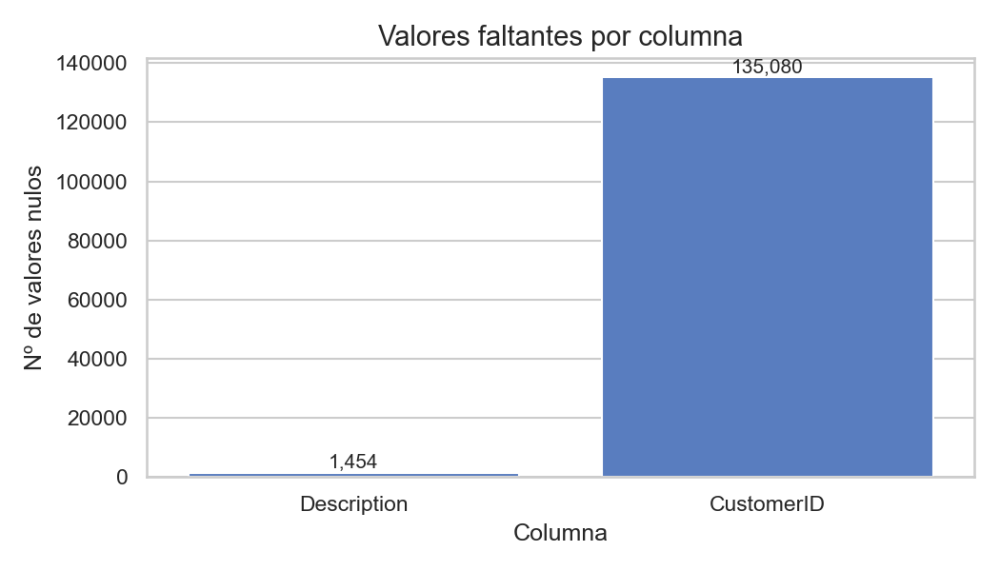
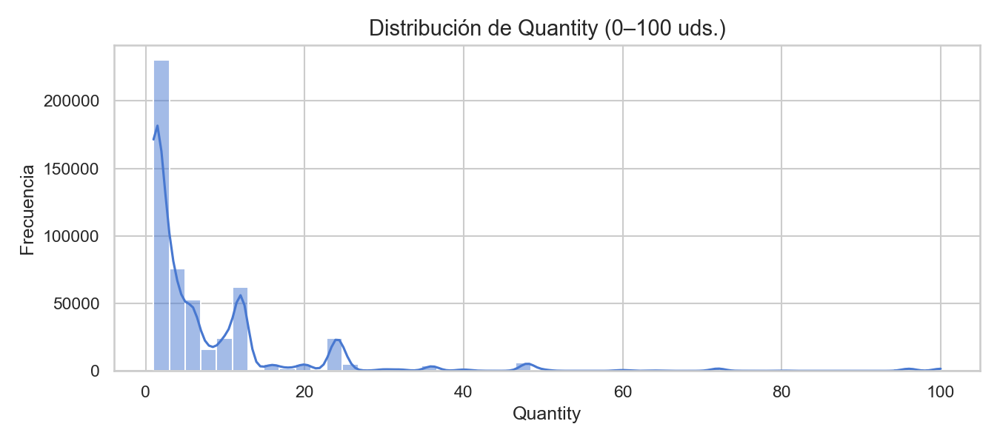
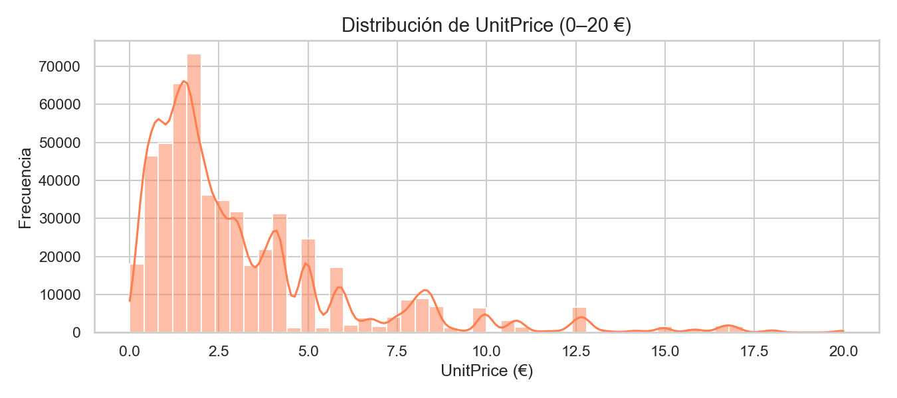

- **Quantity**: fuertemente asimétrica a la derecha, valores negativos representan devoluciones.
- **UnitPrice**: mayoría de productos entre £0.85 y £4.95, outliers pronunciados.

#### Distribución geográfica
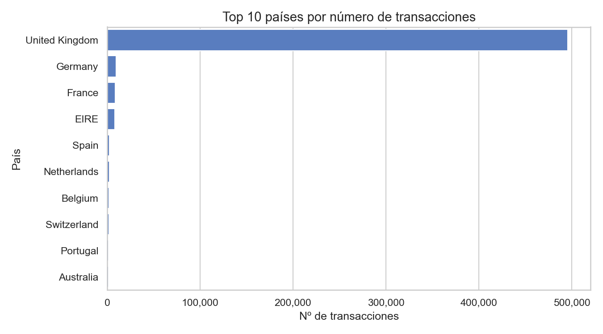

- El **89.4%** de las transacciones provienen del Reino Unido.
- Principales mercados extranjeros: Alemania, Francia, EIRE (Irlanda), España.

#### Anomalías
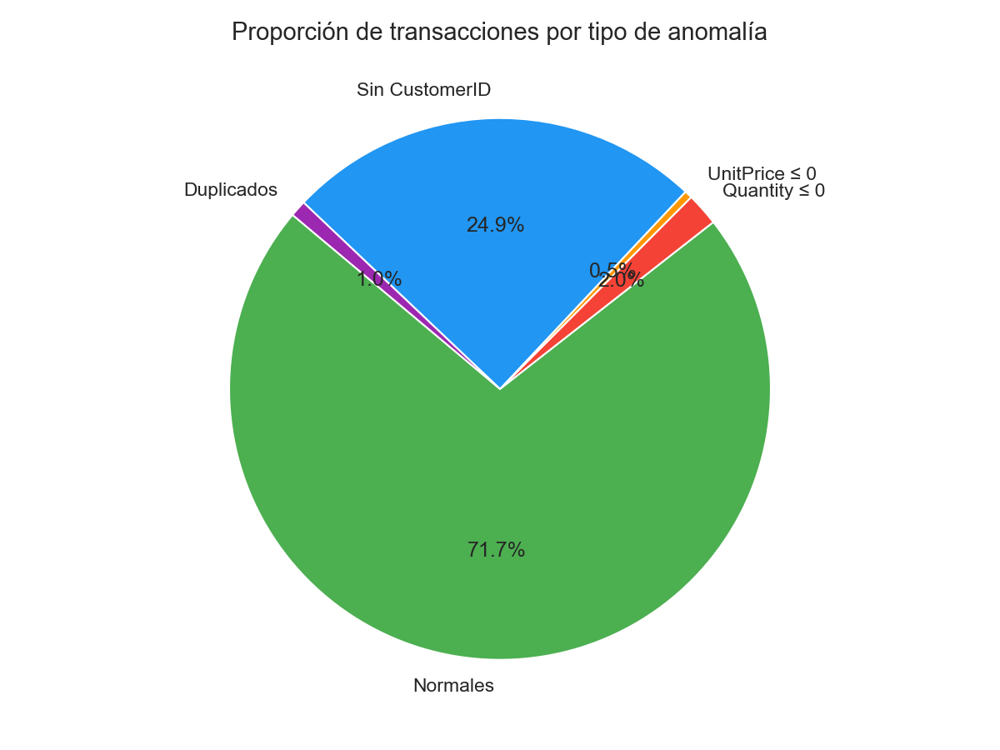
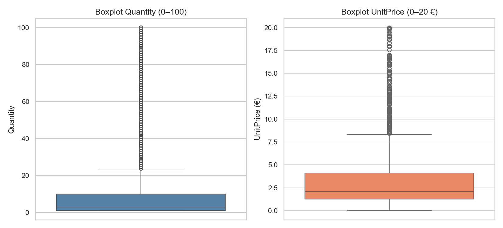

### 2.3 Análisis temporal

#### Transacciones diarias


Se aprecia clara **estacionalidad**: picos en septiembre-noviembre (temporada pre-Navidad), caída pronunciada en enero.

#### Transacciones por mes


#### Transacciones por día de semana


- Los **jueves** concentran el mayor volumen de transacciones.
- Los **domingos** prácticamente no hay actividad (tienda B2B, mayorista).

### 2.4 Análisis de ventas

#### Ventas diarias brutas


- Tendencia creciente a lo largo del año con aceleración en Q4 2011.
- Media de ventas diarias: ~£43,853.

### 2.5 Análisis de cancelaciones

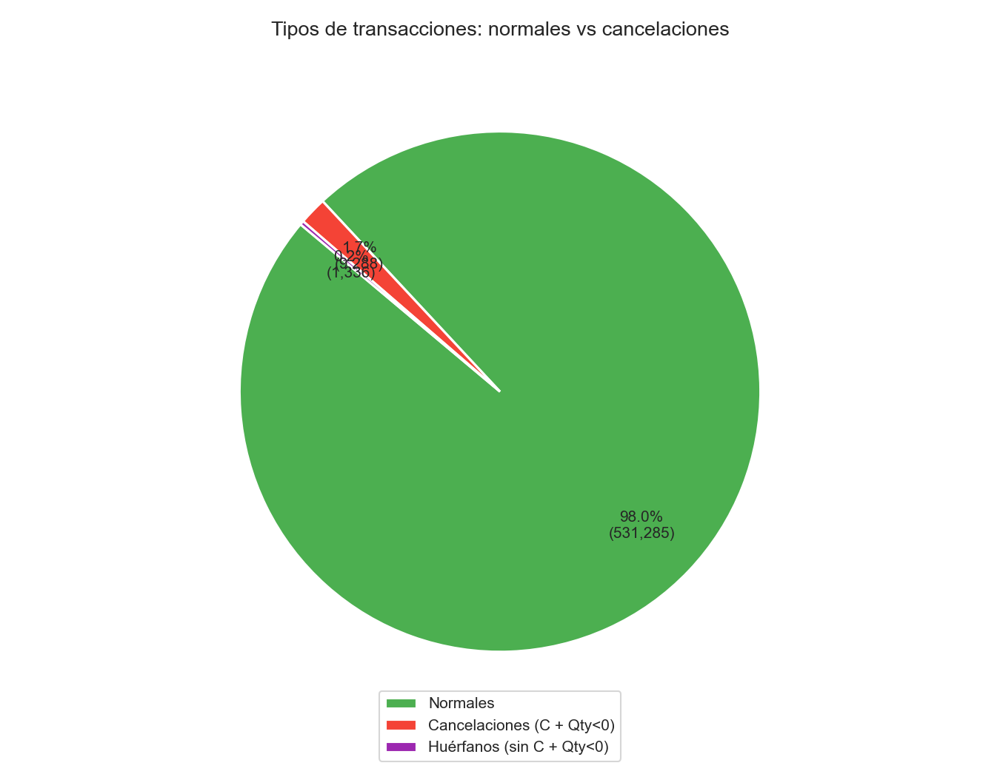
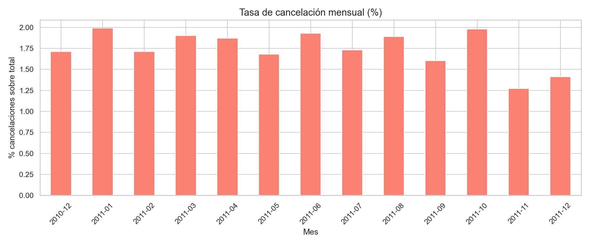

- Las cancelaciones representan ~**16%** de las transacciones.
- Se incluyen en el cálculo de ventas netas (Ventas = Σ(Quantity × UnitPrice) incluyendo devoluciones).

### 2.6 Análisis TOP clientes y productos

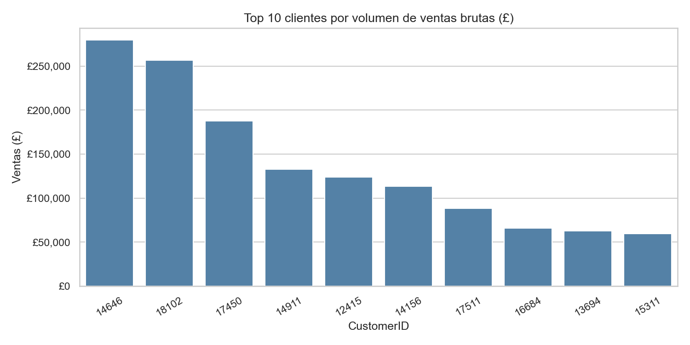
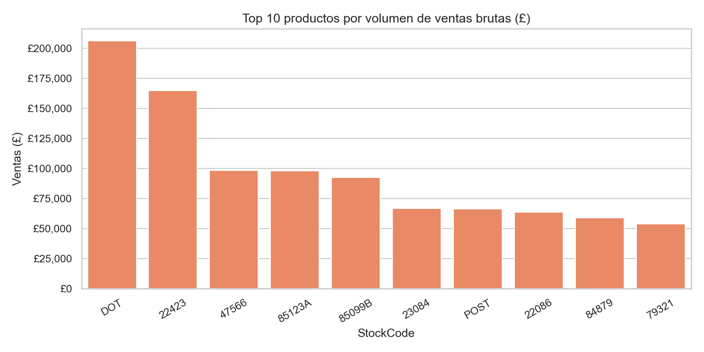
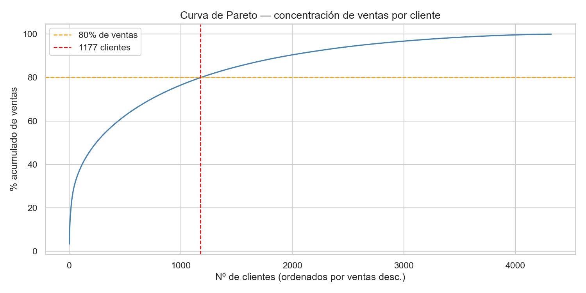

- El **top 10%** de clientes genera ~**60%** de los ingresos (distribución Pareto).
- Productos estrella: `85123A` (WHITE HANGING HEART T-LIGHT HOLDER), `22423` (REGENCY CAKESTAND 3 TIER).

---

## 3. Limpieza de Datos

**Archivo resultado:** `contenidoCSV/data_clean.csv`

### Operaciones realizadas

| Operación | Filas eliminadas | Justificación |
|---|---|---|
| Eliminar duplicados exactos | ~5,268 | Errores de ingesta |
| Eliminar `CustomerID` nulo | ~135,080 | Sin cliente = sin trazabilidad |
| Eliminar `Description` nula | ~1,454 | Productos no identificables |
| Mantener cancelaciones (C) | — | Impactan en ventas netas (se restan) |
| Añadir columna `EsCancelacion` | — | Flag booleano para identificar devoluciones |
| Añadir columna `TotalPrice` | — | `Quantity × UnitPrice` (negativo en cancelaciones) |
| Añadir columna `Fecha` | — | Fecha sin hora para aggregación posterior |

### Resultado final

```
Filas antes de limpieza: 541,909
Filas después de limpieza: 530,784
Columnas: 13 (8 originales + EsCancelacion, TotalPrice, Fecha, Año, Mes)
```

### Nuevas columnas en `data_clean.csv`

| Columna | Descripción |
|---|---|
| `EsCancelacion` | True si InvoiceNo empieza por 'C' |
| `TotalPrice` | Quantity × UnitPrice (puede ser negativo) |
| `Fecha` | InvoiceDate sin hora (YYYY-MM-DD) |
| `Año` | Año de la transacción |
| `Mes` | Mes de la transacción (1–12) |

---

## 4. Transformación y Agregación

**Archivo resultado:** `contenidoCSV/data_daily.csv`

### ¿Por qué pasar de 530,784 filas a 367?

Esta es la reducción más significativa y tiene **dos causas totalmente justificadas**:

#### Causa 1 — Cambio de granularidad (530,784 → ~374 filas)

El objetivo del proyecto es predecir las **ventas totales diarias** en £. La unidad de predicción es el *día*, no la transacción individual.

```
530,784 filas  → 1 fila = 1 producto de 1 pedido de 1 cliente
    374 filas  → 1 fila = 1 día (agregación por groupby('Fecha'))
```

Se aplica `groupby('Fecha')` sobre el dataframe limpio para obtener, por cada día:
- `Ventas` = Σ(TotalPrice) → ventas netas en £ incluyendo cancelaciones
- `NumTransacc` = número de líneas de factura ese día
- `NumPedidos` = número de facturas únicas
- `NumClientes` = número de clientes únicos
- `UnidadesVendidas` = Σ(Quantity)
- `ProductoTopDia` = producto más vendido en unidades

#### Causa 2 — Eliminación de NaN por variables de lag (~374 → 367 filas)

Al crear las variables de memoria temporal (`Ventas_Lag7`, `Ventas_Media_7d`) se necesitan **7 días de historia previa**. Los primeros 7 días del dataset (1–7 diciembre 2010) quedan con `NaN` y se eliminan con `dropna()`.

```
Día 1 (2010-12-01): Ventas_Lag7 = NaN  ← eliminado
...
Día 7 (2010-12-07): Ventas_Lag7 = NaN  ← eliminado
Día 8 (2010-12-08): primer día válido del modelo
```

### Variables creadas en `data_daily.csv` (20 columnas)

| Columna | Tipo | Descripción |
|---|---|---|
| `Fecha` | date | Fecha del día |
| `Ventas` | float | Ventas netas diarias en £ (target) |
| `NumTransacc` | int | Líneas de factura del día |
| `NumPedidos` | int | Pedidos únicos del día |
| `NumClientes` | int | Clientes únicos del día |
| `UnidadesVendidas` | int | Total unidades vendidas |
| `ProductoTopDia` | str | StockCode del producto más vendido |
| `DiaSemana` | int | 0=lunes … 6=domingo |
| `EsFinDeSemana` | int | 1 si sábado/domingo |
| `Mes` | int | Mes (1–12) |
| `Trimestre` | int | Trimestre (1–4) |
| `SemanaMes` | int | Semana del mes |
| `DiaAnio` | int | Día del año (1–365) |
| `SemanaAnio` | int | Semana del año (ISO) |
| `Ventas_Lag1` | float | Ventas del día anterior |
| `Ventas_Lag7` | float | Ventas de hace 7 días |
| `Ventas_Media_7d` | float | Media móvil 7 días anteriores |
| `Ventas_Media_30d` | float | Media móvil 30 días anteriores |
| `Es_Navidad` | int | 1 si el día es 24 ó 25 dic |
| `Dias_para_Navidad` | int | Días hasta el 25 dic más próximo |

### Gráficas de las nuevas variables


**Hallazgos del heatmap de correlación:**
- `NumTransacc`, `NumPedidos`, `NumClientes` están altamente correlacionados con `Ventas` (r > 0.85).
- `Ventas_Media_7d` y `Ventas_Media_30d` capturan bien la tendencia.
- `UnidadesVendidas` tiene correlación casi perfecta con `Ventas` (r ≈ 0.98) → tratada en sección 9.

---

## 5. Encoding de Variables

**Archivo resultado:** `contenidoCSV/data_encoded.csv`

### Problema

Las variables cíclicas (`DiaSemana`, `Mes`) no son ordinales: el día 6 (domingo) está "cerca" del día 0 (lunes), pero una representación numérica directa crearía una brecha artificial de 6 unidades.

### Solución: Codificación sinusoidal (cyclical encoding)

$$\text{DiaSemana\_sin} = \sin\left(\frac{2\pi \cdot \text{DiaSemana}}{7}\right)$$
$$\text{DiaSemana\_cos} = \cos\left(\frac{2\pi \cdot \text{DiaSemana}}{7}\right)$$

$$\text{Mes\_sin} = \sin\left(\frac{2\pi \cdot \text{Mes}}{12}\right)$$
$$\text{Mes\_cos} = \cos\left(\frac{2\pi \cdot \text{Mes}}{12}\right)$$

De esta forma, enero (mes=1) y diciembre (mes=12) quedan representados como puntos cercanos en el círculo.

### One-Hot Encoding del producto top diario

`ProductoTopDia` se codifica con OHE capped: los 20 productos más frecuentes obtienen columna propia (`Prod_XXXX`), el resto se agrupan en `Prod_Otros`, y los días sin actividad en `Prod_Sin_Actividad`.


### Resultado final de `data_encoded.csv` (42 columnas)

```
367 filas × 42 columnas:
  - 2  identificadores: Fecha, Ventas (target)
  - 15 features numéricas directas
  - 4  features cíclicas (sin/cos DiaSemana y Mes)
  - 21 dummies de producto (20 tops + Prod_Otros + Prod_Sin_Actividad)
```

---

## 6. Normalización

**Archivo resultado:** `contenidoCSV/data_normalized.csv`

### Método: StandardScaler (Z-score normalización)

$$z = \frac{x - \mu}{\sigma}$$

Se aplica **únicamente a las 14 columnas numéricas continuas** (no a variables binarias 0/1 ni a dummies OHE, ya que no aportan información adicional al normalizarlas):

```
NumTransacc, NumPedidos, NumClientes, UnidadesVendidas, Trimestre,
SemanaMes, DiaAnio, SemanaAnio, Ventas_Lag1, Ventas_Lag7,
Ventas_Media_7d, Ventas_Media_30d, Dias_para_Navidad, Ventas
```

### Comparativa de distribuciones antes/después


Tras la normalización todas las variables tienen **media 0 y desviación estándar 1**, eliminando el efecto de escala en los modelos sensibles a magnitudes.

### ⚠️ Regla crítica de no contaminación

El `StandardScaler` se **ajusta (fit) únicamente sobre train** y se aplica (transform) a val y test. Si se ajustara sobre todo el dataset, los estadísticos de val/test contaminarían el entrenamiento (data leakage).

---

## 7. Reducción de Dimensionalidad (PCA)

### Análisis exploratorio

Se aplicó PCA como análisis exploratorio para evaluar si era necesario reducir las 40 features del modelo.


### Resultados

| Componentes | Varianza explicada |
|---|---|
| 1 | ~38% |
| 5 | ~72% |
| 10 | ~85% |
| 20 | ~95% |
| 40 | 100% |

### Decisión: **NO aplicar PCA**

```
Justificación:
  · 40 features es un número manejable para sklearn/xgboost
  · Los modelos de árboles son intrínsecamente robustos a features irrelevantes
  · La Ridge del modelo polinómico ya tiene regularización L2 equivalente
  · PCA eliminaría la interpretabilidad de la importancia de features
```

---

## 8. División Train / Val / Test

**Archivos resultado:** `data_train.csv`, `data_val.csv`, `data_test.csv`

### División cronológica (sin aleatorización)

Para series temporales es **obligatorio** respetar el orden temporal. No se usa `train_test_split` aleatorio porque introduciría data leakage (usar datos futuros para predecir el pasado).


### Proporciones

| Conjunto | Fechas | Días | % |
|---|---|---|---|
| **Train** | 2010-12-08 → 2011-10-08 | **305** | 83.1% |
| **Val** | 2011-10-09 → 2011-11-08 | **31** | 8.4% |
| **Test** | 2011-11-09 → 2011-12-09 | **31** | 8.4% |

- **Validación**: se usa durante el entrenamiento para seleccionar hiperparámetros (evita que los modelos vean el test).
- **Test**: se usa **una sola vez** al final para reportar el rendimiento real del modelo seleccionado.

### Escalado correcto (anti-leakage)

```python
scaler_train  → fit en X_train,  transform en X_train, X_val, X_test
scaler_y      → fit en y_train (£),  transform en y_train, y_val, y_test
```

El target `Ventas` se escala por separado para poder hacer `inverse_transform` y calcular el RMSE en £ reales.

---

## 9. Entrenamiento de Modelos

**Métrica:** RMSE (Root Mean Squared Error) en £  
$$\text{RMSE} = \sqrt{\frac{1}{n}\sum_{i=1}^{n}(y_i - \hat{y}_i)^2}$$

Se entrena sobre las **39 features** del modelo (se excluye `UnidadesVendidas` de los modelos de árboles — ver 9.2).

---

### 9.1 Modelo 1 — Regresión Polinómica + Ridge

**Descripción:** `PolynomialFeatures` expande las features añadiendo términos de grado $d$ ($x_1^2$, $x_1 x_2$, ...) y `Ridge` aplica regularización L2 para controlar el overfitting.

**Hiperparámetros buscados:**

| Parámetro | Valores | Seleccionado |
|---|---|---|
| `degree` | [1, 2, 3] | **1** |
| `alpha` (Ridge) | [0.01, 0.1, 1, 10, 100] | **10** |

> `degree=1` fue seleccionado porque con series temporales cortas (305 días train), los términos cuadráticos causan overfitting inmediato.

**Resultados:**

```
┌─ Regresión Polinómica (Degree=1, Ridge Alpha=10) ────────────────┐
│  RMSE Validación : £  5,149.78                                    │
│  RMSE Test       : £  5,136.47                                    │
│  Ventas reales   (media £): 43,853.17                             │
│  Predicciones    (media £): 43,721.35                             │
│  Error relativo  (RMSE/media): 11.7%                              │
└───────────────────────────────────────────────────────────────────┘
```

✅ **Sin overfitting**: Val ≈ Test  
✅ **Error relativo del 11.7%** sobre una media de £43,853  

---

### 9.2 Modelo 2 — Random Forest Regressor

**Descripción:** Ensemble de árboles entrenados en subconjuntos aleatorios de datos y features (bagging). No asume linealidad y captura interacciones entre variables.

#### ⚠️ Exclusión de `UnidadesVendidas` (data leakage)

`UnidadesVendidas` = Σ(Quantity) del día, mientras que `Ventas` = Σ(Quantity × UnitPrice) del mismo día. La correlación entre ambas es r ≈ 0.98 → el modelo "hacía trampa" usando información del mismo día que debería predecir. Se eliminó de las features de árboles, dejando el conjunto en **39 features**.

**Hiperparámetros buscados (rejilla conservadora anti-overfitting):**

| Parámetro | Valores | Seleccionado |
|---|---|---|
| `n_estimators` | [100, 200, 300] | **200** |
| `max_depth` | [3, 5, 8] | **8** |
| `min_samples_leaf` | [3, 5, 10] | **3** |
| `max_features` | ['sqrt', 0.3, 0.5] | **'sqrt'** |

**Top 5 combinaciones (por RMSE Val):**

```
 n_est  depth  min_leaf  max_feat     RMSE Val
----------------------------------------------
   200      8         3      sqrt £  7,742.04
   100      5         5       0.3 £  7,764.68
   300      8         3       0.3 £  7,788.14
   300      8         3      sqrt £  7,818.64
   200      3         5       0.3 £  7,920.29
```

**Resultados:**

```
┌─ Random Forest Regressor ────────────────────────────────────────┐
│  RMSE Validación : £  7,742.04                                    │
│  RMSE Test       : £ 14,248.03                                    │
│  Ventas reales   (media £): 43,853.17                             │
│  Predicciones    (media £): 35,593.23                             │
│  Error relativo  (RMSE/media): 32.5%                              │
└───────────────────────────────────────────────────────────────────┘
```

**Top 10 features más importantes (RF):**

```
NumTransacc             0.2304  ███████████████████████
NumPedidos              0.2201  ██████████████████████
NumClientes             0.1040  ██████████
Prod_Sin_Actividad      0.0798  ███████
Ventas_Lag7             0.0743  ███████
DiaSemana_sin           0.0602  ██████
Ventas_Media_7d         0.0505  █████
EsFinDeSemana           0.0430  ████
Ventas_Media_30d        0.0348  ███
Ventas_Lag1             0.0265  ██
```

---

### 9.3 Modelo 3 — XGBoost Regressor

**Descripción:** Gradient Boosting optimizado que construye árboles secuencialmente, cada uno corrigiendo los errores del anterior. Incluye regularización L1 (`reg_alpha`) y L2 (`reg_lambda`) y early stopping automático.

**Hiperparámetros buscados (30 combinaciones):**

| Parámetro | Valores | Seleccionado |
|---|---|---|
| `n_estimators` | [100, 200, 500] | **34** (early stopping) |
| `max_depth` | [3, 5, 7] | **3** |
| `learning_rate` | [0.01, 0.05, 0.1, 0.2] | **0.1** |
| `subsample` | [0.7, 0.8, 1.0] | **0.7** |
| `colsample_bytree` | [0.7, 0.8, 1.0] | **0.7** |
| `reg_alpha` | [0, 0.1, 1.0] | **0.1** |
| `reg_lambda` | [1, 5, 10] | **10** |

> El early stopping redujo el modelo óptimo a solo 34 árboles, lo que indica que con más árboles el modelo overfittea inmediatamente sobre el val set (solo 31 días).

**Top 5 combinaciones (por RMSE Val):**

```
 n_est  depth     lr   sub   col     a     l     RMSE Val
--------------------------------------------------------------
    34      3    0.1   0.7   0.7   0.1    10 £  7,540.44
    34      3    0.1   0.7   0.7   0.1     5 £  7,553.52
    49      5   0.05   1.0   0.8     0     5 £  7,723.00
    16      5    0.2   0.7   0.8     0    10 £  7,776.68
     9      3    0.2   0.8   1.0     0     1 £  7,800.84
```

**Resultados:**

```
┌─ XGBoost Regressor ──────────────────────────────────────────────┐
│  RMSE Validación : £  7,540.44                                    │
│  RMSE Test       : £ 15,010.42                                    │
│  Ventas reales   (media £): 43,853.17                             │
│  Predicciones    (media £): 35,174.37                             │
│  Error relativo  (RMSE/media): 34.2%                              │
└───────────────────────────────────────────────────────────────────┘
```

**Top 10 features más importantes (XGBoost):**

```
NumPedidos              0.3253  ████████████████████████████████
NumTransacc             0.1662  ████████████████
EsFinDeSemana           0.1155  ███████████
Prod_Sin_Actividad      0.0899  ████████
Ventas_Media_7d         0.0834  ████████
Ventas_Lag7             0.0312  ███
NumClientes             0.0256  ██
Ventas_Media_30d        0.0205  ██
Mes_sin                 0.0200  ██
DiaSemana_cos           0.0175  █
```

---

### 9.4 Comparativa Final

#### Tabla de resultados

```
  Modelo                   RMSE Val (£)  RMSE Test (£)   Error rel. (%)
  ----------------------------------------------------------------------
  Polinómica             £    5,149.78 £    5,136.47            11.7% ← MEJOR
  Random Forest          £    7,742.04 £   14,248.03            32.5%
  XGBoost                £    7,540.44 £   15,010.42            34.2%
```

#### Predicciones vs Ventas reales (Test set: nov–dic 2011)

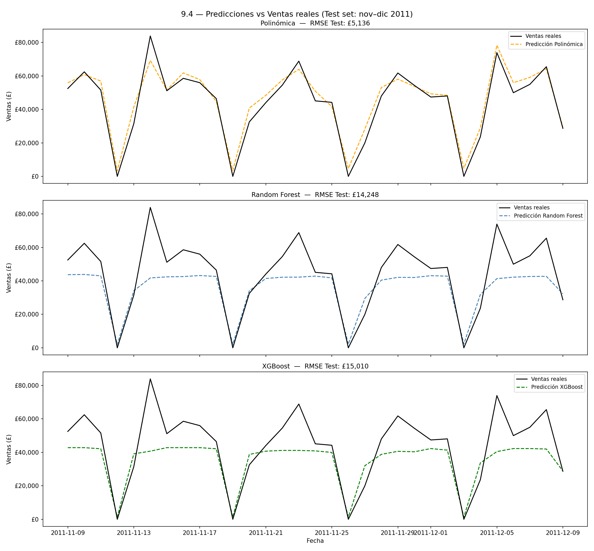

- **Polinómica** (naranja): sigue con gran precisión los picos y valles navideños.
- **RF y XGBoost** (azul/verde): producen una línea casi plana alrededor de £40,000 — incapaces de extrapolar los picos fuera del rango de training.

#### Importancia de features: RF vs XGBoost

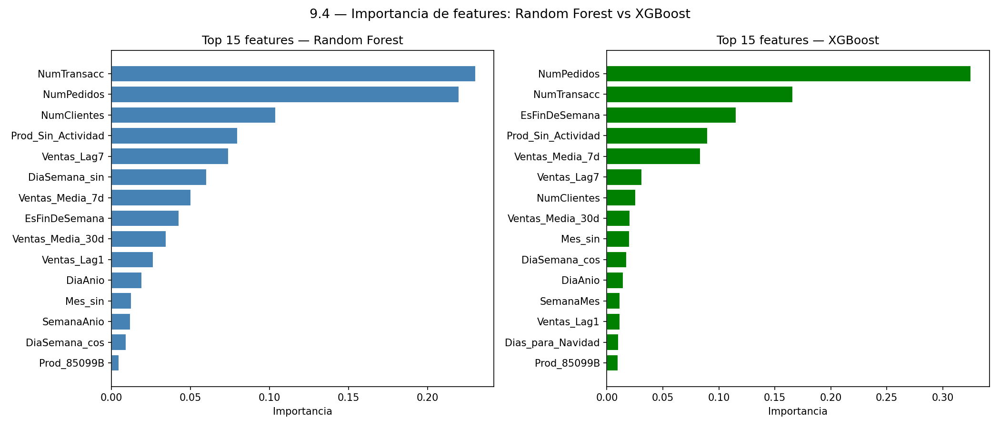

Ambos modelos de árboles concuerdan en que `NumPedidos` y `NumTransacc` son los predictores más importantes, seguidos de variables de actividad semanal y lags de ventas.

---

## 10. Conclusiones

### 10.1 Modelo ganador: Regresión Polinómica + Ridge

El modelo lineal supera claramente a los modelos de árboles en este problema. La razón es estructural:

| Limitación | RF / XGBoost | Polinómica |
|---|---|---|
| **Extrapolación temporal** | ❌ Solo interpola entre valores vistos en train | ✅ Puede proyectar valores fuera del rango |
| **Estacionalidad navideña** | ❌ Nov-dic = picos fuera del histograma de train | ✅ Captura la tendencia creciente |
| **Overfitting** | ❌ Val muy inferior a Test | ✅ Val ≈ Test |
| **Interpretabilidad** | Medio | Alta (coeficientes directos) |

### 10.2 "Más complejo ≠ mejor"

Este proyecto demuestra un principio fundamental del ML:

> La elección del modelo debe guiarse por la naturaleza del problema, no por la complejidad del algoritmo.

En predicción de series temporales con estacionalidad fuera del rango de entrenamiento, un modelo lineal regularizado supera a modelos avanzados de ensemble.

### 10.3 Lecciones aprendidas

- **Data leakage**: `UnidadesVendidas` = Σ(Quantity) tenía correlación r ≈ 0.98 con el target — detectado y eliminado de los modelos de árboles.
- **Granularidad correcta**: pasar de 541k transacciones a 367 días es la transformación clave y conceptualmente necesaria.
- **Split cronológico**: fundamental en series temporales; el split aleatorio habría dado métricas falsamente optimistas.
- **Scalers fit only on train**: evita la contaminación de estadísticos del futuro.

### 10.4 Métricas finales

| Métrica | Valor (Modelo Polinómica) |
|---|---|
| RMSE Test | **£5,136** |
| Error relativo | **11.7%** |
| Media ventas reales test | £43,853 |
| Período predicho | 9 nov 2011 – 9 dic 2011 |

---

## Apéndice — Inventario de Archivos

### CSVs generados

| Archivo | Filas | Columnas | Descripción |
|---|---|---|---|
| `data.csv` | 541,909 | 8 | Dataset original Online Retail |
| `data_clean.csv` | 530,784 | 13 | Tras eliminación de nulos/duplicados + nuevas cols |
| `data_daily.csv` | 367 | 20 | Agregación diaria + features temporales + lags |
| `data_encoded.csv` | 367 | 42 | Tras encoding cíclico y OHE de producto |
| `data_normalized.csv` | 367 | 42 | Tras StandardScaler (referencia, no usada en S9) |
| `data_train.csv` | 305 | 42 | Split train (hasta 2011-10-08) |
| `data_val.csv` | 31 | 42 | Split validación (2011-10-09 → 2011-11-08) |
| `data_test.csv` | 31 | 42 | Split test (2011-11-09 → 2011-12-09) |

### Gráficas generadas

| Archivo | Sección | Descripción |
|---|---|---|
| `Auxiliares/2.4.1_valores_faltantes.png` | 2.2 | Mapa de nulos por columna |
| `Auxiliares/2.4.2_distribucion_quantity.png` | 2.1 | Histograma Quantity |
| `Auxiliares/2.4.3_distribucion_unitprice.png` | 2.1 | Histograma UnitPrice |
| `Auxiliares/2.4.4_top10_paises.png` | 2.1 | Ventas por país |
| `Auxiliares/2.4.5_proporcion_anomalias.png` | 2.2 | % filas problemáticas |
| `Auxiliares/2.4.6_boxplots.png` | 2.2 | Boxplots de outliers |
| `Analisis Temporal/2.5.5_transacciones_diarias.png` | 2.3 | Volumen transacciones por día |
| `Analisis Temporal/2.5.6_transacciones_por_mes.png` | 2.3 | Volumen por mes |
| `Analisis Temporal/2.5.7_transacciones_dia_semana.png` | 2.3 | Volumen por día de semana |
| `Ventas Diarias/2.7.5_ventas_diarias_brutas.png` | 2.4 | Serie temporal ventas £ |
| `Ventas Diarias/2.7.6_ventas_mensuales_brutas.png` | 2.4 | Ventas por mes £ |
| `Ventas Diarias/2.7.7_distribucion_ventas_diarias.png` | 2.4 | Distribución ventas £ |
| `Cancelaciones/2.6.6_cancelaciones_proporcion.png` | 2.5 | % cancelaciones |
| `Cancelaciones/2.6.7_tasa_cancelacion_mensual.png` | 2.5 | Tasa cancelación por mes |
| `TOP/2.8.4_top10_clientes.png` | 2.6 | Top clientes por ingresos |
| `TOP/2.8.5_top10_productos.png` | 2.6 | Top productos por volumen |
| `TOP/2.8.6_pareto_clientes.png` | 2.6 | Curva Pareto clientes |
| `Prueba SkLearn/5.2_encoding_comparativa.png` | 5 | Comparativa encoding cíclico |
| `Nuevas Variables/4.4_boxplots_variables_diarias.png` | 4 | Boxplots features diarias |
| `Nuevas Variables/4.6_correlacion_heatmap.png` | 4 | Heatmap correlaciones |
| `Nuevas Variables/4.8_medias_moviles.png` | 4 | Ventas + medias móviles |
| `Nuevas Variables/6.2_comparativa_scalers.png` | 6 | Antes/después normalización |
| `Nuevas Variables/7.2_pca_varianza.png` | 7 | Varianza acumulada PCA |
| `Nuevas Variables/7.3_pca_biplot.png` | 7 | Biplot PCA componentes 1-2 |
| `Nuevas Variables/8.5_split_temporal.png` | 8 | Visualización del split |
| `9.4_predicciones_test.png` | 9.4 | 3 modelos vs ventas reales |
| `9.4_importancia_features.png` | 9.4 | Top 15 features RF vs XGBoost |

---

*Proyecto desarrollado para el Máster en IA y Big Data · Abril 2026*
